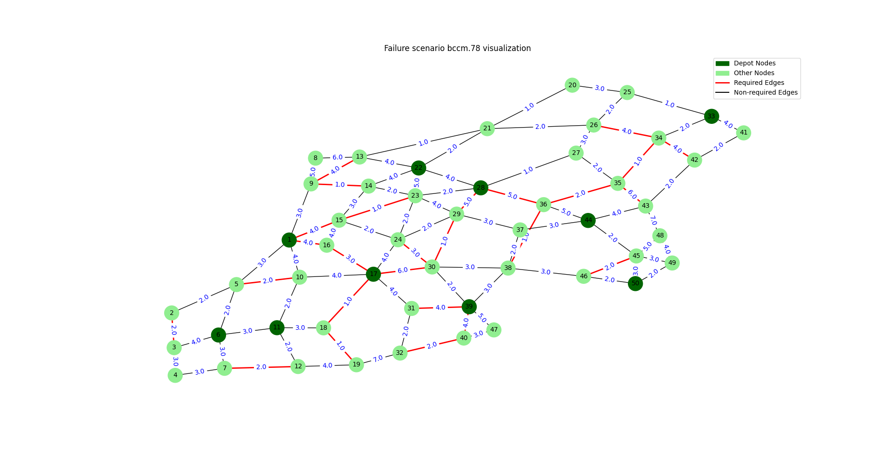

# Rescheduling-multi-depot-multi-trip-rural=l-postman-problem-instances
This repository contains failure scenarios to test algorithms developed to handle multiple vehicle failures in multi-depot rural postman problem with rechargeable and reusable vehicles capable of performing multiple trips 

## Capacitated Arc Routing Problem (CARP) Instances:
The failure scenarios are created from CARP instances from the literature. Three well known CARP instances are used namely
1. GDB
2. BCCM
3. EGLESE

These instances can be found in "CARP instances" folder in the root directory of the respository. These instances are originally obtained from [here](https://www.uv.es/belengue/carp.html).

## Failure Scenarios

The `Failure_Scanarios` folder contains the failure scenarios generated from the CARP instances. Each scenario simulates multiple vehicle failures in a multi-depot setting with vehicles capable of performing multiple trips and recharging. The failure scenarios and the number of the scenarios is consistent with the results in the paper. The following is the directory structure:
- Failure_Scenarios/
    - gdb_failure_scenarios/
        - gdb.1.txt
        - gdb.2.txt
        - ...
    - bccm_failure_scenarios/
        - bccm.1.txt
        - bccm.2.txt
        - ...
    - eglese_failure_scenarios/
        - eglese.1.txt
        - eglese.2.txt
        - ...


## Visualization

The repository includes a script `visualize_failure_scenario.py` to visualize the failure scenarios.

### How to Visualize Failure Scenarios

#### 1. Install the Required Software

- **Python**: Ensure you have Python 3.7 or higher installed on your system.

- **Required Python Packages**:

  - `networkx`
  - `matplotlib`
  - `numpy`

  You can install these packages using `pip`:

  ```bash
  pip install networkx matplotlib numpy

#### 2. Usage
- To visualize a failure scenario, run the visualize_failure_scenario.py script as follows:
  ```bash
  python visualize_failure_scenario.py
- Sample ouput: The following is a sample output produced
  ```bash
  Enter instance name (gdb, bccm, eglese): bccm
  Enter failure scenario number [1-108]: 78


## Reference
1. paper - reference